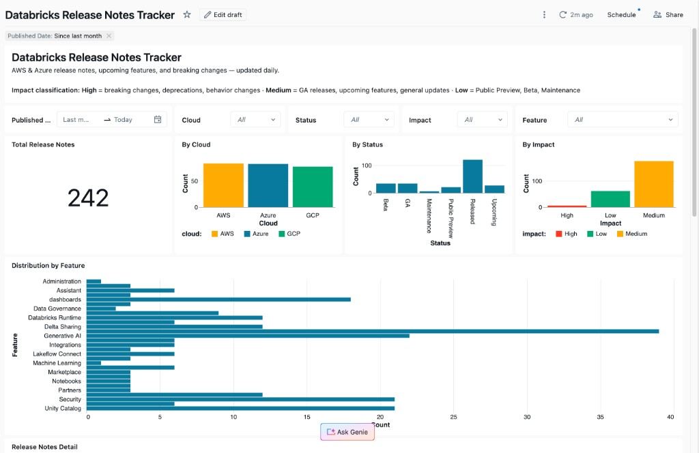
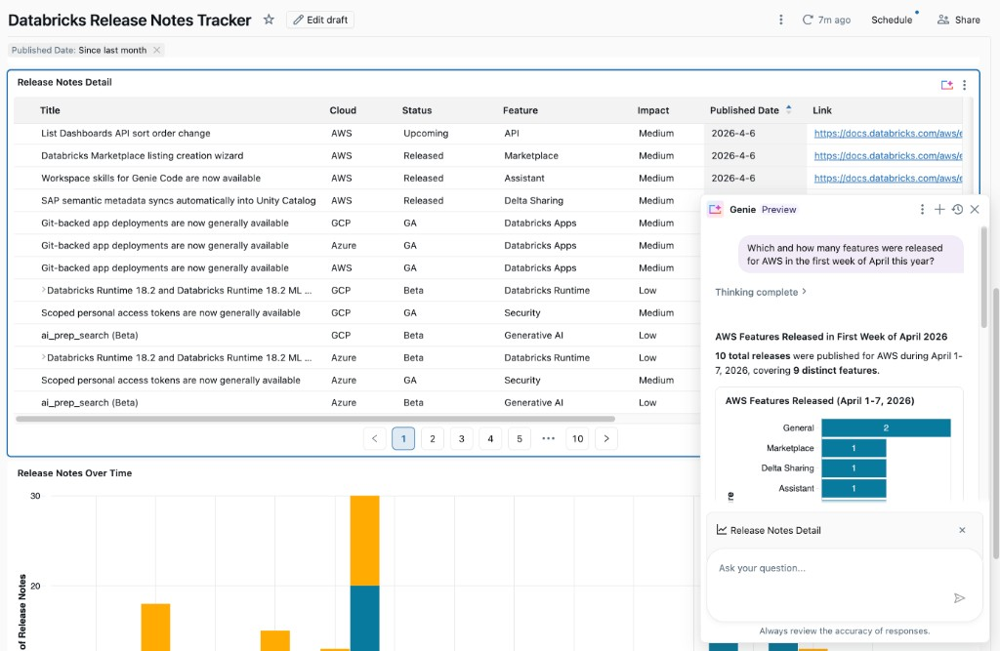

# Databricks Release Notes Dashboard

Databricks Asset Bundle that ingests **AWS**, **Azure**, and **GCP** release notes daily and powers the **Release Notes Tracker** dashboard.





## Architecture

```
RSS Feeds (AWS, Azure, GCP) ─► Notebook (MERGE) ─► Delta Table ─► Dashboard
```

| Resource | Description |
| --- | --- |
| **Job** | `Daily Databricks Release Notes ETL`, runs at 06:00 SGT |
| **Table** | `<catalog>.<schema>.release_notes` |
| **Dashboard** | `Databricks Release Notes Tracker` |

## Bundle structure

```
dbx-release-notes-dashboard/
├── databricks.yml                        # Bundle config, variables, targets
├── resources/
│   ├── release_notes_job.yml             # Job: schedule, timeout
│   └── release_notes_dashboard.yml       # Dashboard: warehouse, catalog/schema
└── src/
    ├── release_notes_etl.ipynb           # ETL notebook
    └── release_notes_tracker.lvdash.json # Dashboard definition
```

## Variables

All variables without defaults are **required** and must be set at deploy time.

| Variable | Default | Description |
| --- | --- | --- |
| `catalog` | *(required)* | Unity Catalog catalog |
| `schema` | `databricks_release_notes` | Unity Catalog schema (created automatically if it doesn't exist) |
| `warehouse_id` | *(required)* | SQL warehouse for the dashboard |

## Quickstart

```bash
# Validate
databricks bundle validate

# Deploy to dev (prefixed, schedule paused)
databricks bundle deploy -t dev \
  --var catalog=my_catalog \
  --var warehouse_id=abc123def456

# Deploy to prod
databricks bundle deploy -t prod \
  --var catalog=prod_catalog \
  --var warehouse_id=abc123def456

# Trigger a run
databricks bundle run -t dev release_notes_etl
```

## Key features

- **Content-hash MERGE:** only updates rows whose content actually changed; reports inserted / updated / untouched counts each run
- **HTTP retry:** exponential backoff on 429 / 5xx errors
- **Dev / Prod targets:** `mode: development` auto-prefixes job name and pauses schedule
- **Dashboard parameterisation:** `dataset_catalog` and `dataset_schema` swap per target
- **Parameterised notebook:** `catalog` and `schema` passed as widget parameters from the job
- **Auto-provisioning:** target schema is created automatically if it doesn't exist
